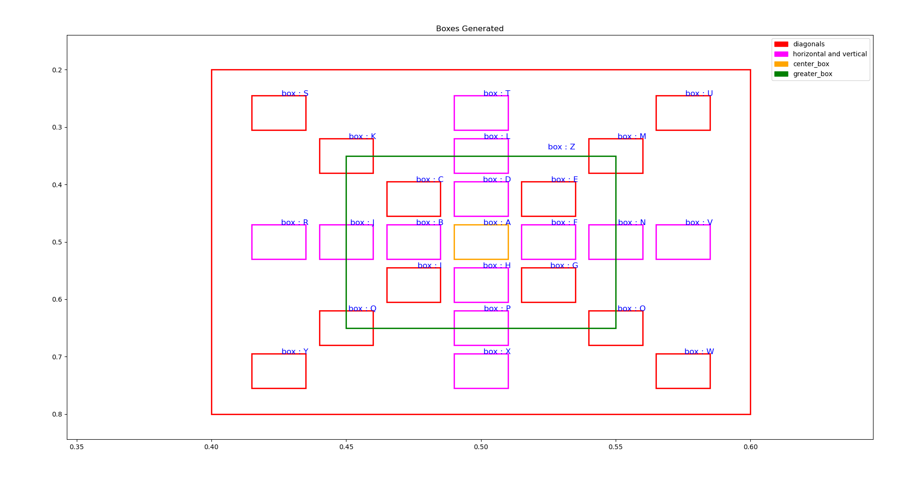

# Spatial-Relations
## Author: Odalisio Leite da Silva Neto

<p align="center">

</p>

## Overview

This repository contains Python scripts for generating and manipulating bounding boxes in computer vision applications. 
The primary files are `generate_equally_spaced_bb.py` and `ltn_relations_milena.py`. 
These scripts provide functionality for creating equally spaced bounding boxes and defining logical relations between them.

## File Descriptions

### 1. `generate_equally_spaced_bb.py`

This script focuses on generating equally spaced bounding boxes within a given bounding box. It includes the following key functions:

- `generate_eq_spaced_bbs_in_(bb, dictionary_with_letters=True)`: Generates equally spaced bounding boxes inside a given bounding box in a clockwise direction. The boxes can be referred to using alphabetical letters.
- `plot_all_bb_with_names(bb, boxes, name=list(string.ascii_uppercase))`: Plots bounding boxes with corresponding names on a Matplotlib figure for visualization.

### 2. `ltn_relations_milena.py`

This script provides functions for handling logical relations between bounding boxes. Key functionalities include:

- `O(bb1, bb2, is_yolo_format=True, is_class_first=False)`: Checks if two bounding boxes overlap.
- `PO(bb1, bb2, is_yolo_format=True, is_class_first=False)`: Checks if two bounding boxes partially overlap.
- `D(bb1, bb2, is_yolo_format=True, is_class_first=False)`: Checks if two bounding boxes are disjoint.
- `plot_bounding_boxes(bb1, bb2, is_class_first=False, is_yolo_format=False)`: Plots two bounding boxes on a 2D plane for visualization.

## Usage

To use these scripts, simply include them in your project and call the relevant functions. 
Refer to the docstrings within the scripts for detailed information on each function.

## Example

```python
# Example using generate_equally_spaced_bb.py
bb1 = [0.5, 0.5, 0.2, 0.6]  # Bounding box
boxes = generate_eq_spaced_bbs_in_(bb1)
plot_all_bb_with_names(bb1, boxes)

# Example using ltn_relations_milena.py
bb1 = tf.constant([0.3, 0.3, 0.2, 0.2])
bb2 = tf.constant([0.3, 0.3, 0.1, 0.1])
result = O(bb1, bb2, is_class_first=False, is_yolo_format=True)
print("Overlap Check:", result)
```

## Dependencies
- NumPy
- Matplotlib
- TensorFlow

